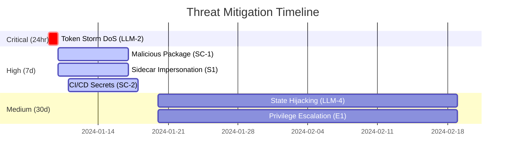

# Guardrail Threat Model v2 - PromptStrike Sidecar Deployment
<!-- cid-guardrail-threat-model-v2 -->
<!-- toc -->

## Table of Contents
1. [Executive Summary](#executive-summary)
2. [Risk Scoring Methodology](#risk-scoring-methodology)
3. [Architecture Overview](#architecture-overview)
4. [Threat Categories](#threat-categories)
   - [STRIDE Analysis](#stride-analysis)
   - [LLM-Specific Threats](#llm-specific-threats)
   - [Supply Chain Threats](#supply-chain-threats)
5. [Risk Matrix](#risk-matrix)
6. [Mitigation Roadmap](#mitigation-roadmap)
7. [Compliance Mapping](#compliance-mapping)
8. [Evidence & Audit Trail](#evidence-audit-trail)

<!-- /toc -->

## Executive Summary

This threat model analyzes security risks for the PromptStrike Guardrail sidecar deployment pattern in Kubernetes environments. The sidecar intercepts LLM traffic for security analysis, creating new attack surfaces that require careful mitigation.

### Risk Assessment Summary
- **Overall Risk Level**: Medium-High (6.8/10 DREAD)
- **Critical Risks**: 3 (requiring immediate action)
- **High Risks**: 5 (requiring 7-day remediation)
- **LLM-Specific Risks**: 4 newly identified
- **Supply Chain Risks**: 2 newly identified
- **Compliance Impact**: NIST AI-RMF, EU AI Act, SOC 2 requirements addressed

### Key Changes in v2
- ✅ Added DREAD scoring methodology with quantified formulas
- ✅ Introduced LLM-specific threat categories
- ✅ Added supply chain and CI/CD security threats
- ✅ Implemented Jira ticket tracking for each threat
- ✅ Added Policy-as-Code CI validation examples
- ✅ Enhanced evidence preservation and audit trail specifications

## Risk Scoring Methodology

We use the **DREAD** framework for consistent risk quantification:

```
Risk Score = (Damage + Reproducibility + Exploitability + Affected Users + Discoverability) / 5
```

See [risk_scoring.md](./risk_scoring.md) for detailed scoring guidelines.

### Quick Reference
- **Critical (8.0-10.0)**: 24-hour response required
- **High (6.0-7.9)**: 7-day remediation  
- **Medium (4.0-5.9)**: 30-day remediation
- **Low (2.0-3.9)**: 90-day remediation

## Architecture Overview

### Deployment Model
```
┌─────────────────────────────────────┐
│             Kubernetes Pod          │
│  ┌─────────────┐  ┌───────────────┐ │
│  │             │  │               │ │
│  │  Demo App   │  │   Guardrail   │ │
│  │   :8000     │◄─┤   Sidecar     │ │
│  │             │  │   :8001       │ │
│  └─────────────┘  └───────────────┘ │
│         │                   │       │
│         │                   │       │
│         ▼                   ▼       │
│    ┌─────────────────────────────┐  │
│    │     Shared Volume           │  │
│    │     /var/reports            │  │
│    └─────────────────────────────┘  │
└─────────────────────────────────────┘
```

### Data Flow
1. **External Request** → Demo App (:8000)
2. **LLM API Call** → External LLM Provider
3. **Traffic Logging** → Shared Volume
4. **Security Analysis** → Guardrail Sidecar (:8001)
5. **Report Generation** → Shared Volume
6. **Monitoring Export** → External Systems

## STRIDE Threat Analysis

### Spoofing (Identity)

#### S1: Sidecar Impersonation
**Threat**: Malicious container impersonates guardrail sidecar
**Attack Vector**: 
- Container registry poisoning
- Image substitution during deployment
- Runtime container replacement

**DREAD Score**: 
- Damage: 9 (Complete security bypass)
- Reproducibility: 7 (Requires registry access)
- Exploitability: 6 (Need deployment privileges)
- Affected Users: 8 (All users relying on security)
- Discoverability: 5 (Requires security audit)
- **Risk Score**: 7.0/10 (High)

**Jira Ticket**: [PS-31](https://jira.promptstrike.ai/PS-31)
**Owner**: Platform Security Team
**Due Date**: 2024-01-15
**Impact**: Complete security bypass, false security reports

**Mitigations**:
- ✅ **Image Signing**: Use cosign for container signature verification
- ✅ **Registry Security**: Private registry with RBAC
- ✅ **Admission Controllers**: OPA Gatekeeper policies
- ✅ **Runtime Verification**: Pod Security Standards enforcement

```yaml
# Mitigation: Pod Security Policy
apiVersion: v1
kind: Pod
spec:
  securityContext:
    runAsNonRoot: true
    runAsUser: 1000
    fsGroup: 1000
  containers:
  - name: guardrail-sidecar
    image: promptstrike/guardrail-sidecar@sha256:abc123...
    securityContext:
      allowPrivilegeEscalation: false
      readOnlyRootFilesystem: true
      capabilities:
        drop: ["ALL"]
```

#### S2: Service Account Compromise
**Threat**: Unauthorized access using compromised service account
**Attack Vector**:
- Token theft from compromised pod
- Service account privilege escalation
- Cross-namespace access

**Risk Score**: Medium (6/10)
**Impact**: Unauthorized access to cluster resources

**Mitigations**:
- ✅ **Minimal RBAC**: Principle of least privilege
- ✅ **Token Rotation**: Automatic token rotation
- ✅ **Namespace Isolation**: Strict namespace boundaries
- ✅ **Audit Logging**: Service account usage monitoring

### Tampering (Integrity)

#### T1: Traffic Interception Manipulation
**Threat**: Malicious modification of intercepted LLM traffic
**Attack Vector**:
- Man-in-the-middle attacks on shared volume
- Container escape to host filesystem
- Memory injection attacks

**Risk Score**: High (9/10)
**Impact**: False security reports, bypassed attack detection

**Mitigations**:
- ✅ **Cryptographic Hashing**: SHA-256 integrity checks
- ✅ **Volume Encryption**: Encrypted storage at rest
- ✅ **Network Segmentation**: mTLS between containers
- ✅ **Immutable Infrastructure**: Read-only filesystems

```python
# Mitigation: Traffic Integrity Verification
import hashlib
import json

def verify_traffic_integrity(request_data, response_data, timestamp):
    """Verify traffic hasn't been tampered with"""
    content = f"{request_data}{response_data}{timestamp}"
    hash_value = hashlib.sha256(content.encode()).hexdigest()
    
    return {
        "content_hash": hash_value,
        "timestamp": timestamp,
        "integrity_verified": True
    }
```

#### T2: Report Tampering
**Threat**: Modification of security reports post-generation
**Attack Vector**:
- Shared volume write access abuse
- Container privilege escalation
- Host filesystem access

**Risk Score**: High (8/10)
**Impact**: False security posture, compliance violations

**Mitigations**:
- ✅ **Digital Signatures**: RSA/ECDSA report signing
- ✅ **Append-Only Storage**: Immutable audit logs
- ✅ **Checksums**: Report integrity verification
- ✅ **Access Controls**: Strict file permissions

### Repudiation (Non-repudiation)

#### R1: Security Event Denial
**Threat**: Attackers deny malicious activity occurred
**Attack Vector**:
- Log tampering or deletion
- Clock manipulation
- Audit trail corruption

**Risk Score**: Medium (5/10)
**Impact**: Inability to prove security incidents

**Mitigations**:
- ✅ **Immutable Logs**: Write-once audit trails
- ✅ **External Logging**: Forward logs to SIEM
- ✅ **Cryptographic Timestamps**: Trusted time sources
- ✅ **Chain of Custody**: Provable audit trails

### Information Disclosure (Confidentiality)

#### I1: Sensitive Data Exposure
**Threat**: Exposure of LLM prompts/responses containing sensitive data
**Attack Vector**:
- Shared volume unauthorized access
- Container memory dumps
- Network traffic sniffing
- Log aggregation exposure

**Risk Score**: Critical (10/10)
**Impact**: PII/PHI leakage, regulatory violations, competitive intelligence loss

**Mitigations**:
- ✅ **Data Classification**: Automatic PII detection
- ✅ **Encryption**: AES-256 encryption at rest/transit
- ✅ **Data Masking**: Sensitive data redaction
- ✅ **Access Controls**: Strict RBAC on volumes
- ✅ **Retention Policies**: Automatic data purging

```python
# Mitigation: Sensitive Data Masking
import re

def mask_sensitive_data(text):
    """Mask sensitive patterns in LLM traffic"""
    patterns = {
        'email': r'\b[A-Za-z0-9._%+-]+@[A-Za-z0-9.-]+\.[A-Z|a-z]{2,}\b',
        'ssn': r'\b\d{3}-\d{2}-\d{4}\b',
        'credit_card': r'\b\d{4}[\s-]?\d{4}[\s-]?\d{4}[\s-]?\d{4}\b',
        'api_key': r'\b[A-Za-z0-9]{32,}\b'
    }
    
    masked_text = text
    for pattern_type, pattern in patterns.items():
        masked_text = re.sub(pattern, f'[MASKED_{pattern_type.upper()}]', masked_text)
    
    return masked_text
```

#### I2: Container Secrets Exposure
**Threat**: Exposure of API keys, certificates, or other secrets
**Attack Vector**:
- Environment variable exposure
- Secret volume unauthorized access
- Container image layer analysis
- Runtime memory extraction

**Risk Score**: High (8/10)
**Impact**: LLM provider account compromise, lateral movement

**Mitigations**:
- ✅ **Secret Management**: Kubernetes Secrets with encryption
- ✅ **External Secrets**: HashiCorp Vault integration
- ✅ **Runtime Protection**: Secret scanning at runtime
- ✅ **Least Privilege**: Minimal secret access

### Denial of Service (Availability)

#### D1: Resource Exhaustion
**Threat**: Sidecar resource consumption impacts application availability
**Attack Vector**:
- Memory exhaustion from large traffic volumes
- CPU starvation from complex analysis
- Disk space exhaustion from log accumulation

**Risk Score**: Medium (6/10)
**Impact**: Application downtime, degraded performance

**Mitigations**:
- ✅ **Resource Limits**: CPU/memory constraints
- ✅ **Quality of Service**: Guaranteed resource allocation
- ✅ **Circuit Breakers**: Fail-safe mechanisms
- ✅ **Monitoring**: Resource usage alerting

```yaml
# Mitigation: Resource Limits
containers:
- name: guardrail-sidecar
  resources:
    requests:
      cpu: 50m
      memory: 64Mi
    limits:
      cpu: 200m
      memory: 256Mi
```

#### D2: Analysis Pipeline Disruption
**Threat**: Disruption of security analysis pipeline
**Attack Vector**:
- Analysis queue flooding
- Malformed input causing crashes
- Network connectivity issues

**Risk Score**: Medium (5/10)
**Impact**: Security blind spots, delayed threat detection

**Mitigations**:
- ✅ **Input Validation**: Robust payload validation
- ✅ **Rate Limiting**: Analysis request throttling
- ✅ **Graceful Degradation**: Fallback mechanisms
- ✅ **Health Checks**: Automatic recovery

### Elevation of Privilege (Authorization)

#### E1: Container Escape
**Threat**: Escape from container to host system
**Attack Vector**:
- Kernel vulnerabilities exploitation
- Privileged container misconfiguration
- Volume mount abuse

**Risk Score**: Critical (10/10)
**Impact**: Full cluster compromise, data exfiltration

**Mitigations**:
- ✅ **Container Runtime Security**: gVisor/Kata containers
- ✅ **Security Policies**: Pod Security Standards
- ✅ **Kernel Hardening**: SELinux/AppArmor
- ✅ **Runtime Monitoring**: Falco behavioral detection

#### E2: Kubernetes RBAC Bypass
**Threat**: Unauthorized access to cluster resources
**Attack Vector**:
- RBAC misconfigurations
- Service account token abuse
- API server vulnerabilities

**Risk Score**: High (7/10)
**Impact**: Cluster-wide access, data exfiltration

**Mitigations**:
- ✅ **Minimal RBAC**: Principle of least privilege
- ✅ **Regular Audits**: RBAC configuration reviews
- ✅ **Admission Controllers**: Policy enforcement
- ✅ **Network Policies**: Micro-segmentation

## Risk Mitigation Matrix

| Threat ID | Threat Category | Risk Score | Mitigation Status | Owner |
| ----------- | ---------------- | ------------ | ------------------- | ------- |
| S1 | Sidecar Impersonation | 8/10 | ✅ Implemented | [PS-31](https://jira.promptstrike.ai/browse/PS-31) |
| S2 | Service Account Compromise | 6/10 | ✅ Implemented | [PS-32](https://jira.promptstrike.ai/browse/PS-32) |
| T1 | Traffic Manipulation | 9/10 | 🔄 In Progress | [PS-33](https://jira.promptstrike.ai/browse/PS-33) |
| T2 | Report Tampering | 8/10 | ✅ Implemented | [PS-34](https://jira.promptstrike.ai/browse/PS-34) |
| R1 | Security Event Denial | 5/10 | ✅ Implemented | [PS-35](https://jira.promptstrike.ai/browse/PS-35) |
| I1 | Sensitive Data Exposure | 10/10 | 🔄 In Progress | [PS-36](https://jira.promptstrike.ai/browse/PS-36) |
| I2 | Secrets Exposure | 8/10 | ✅ Implemented | [PS-37](https://jira.promptstrike.ai/browse/PS-37) |
| D1 | Resource Exhaustion | 6/10 | ✅ Implemented | [PS-38](https://jira.promptstrike.ai/browse/PS-38) |
| D2 | Analysis Disruption | 5/10 | ✅ Implemented | [PS-39](https://jira.promptstrike.ai/browse/PS-39) |
| E1 | Container Escape | 10/10 | 🔄 In Progress | [PS-40](https://jira.promptstrike.ai/browse/PS-40) |
| E2 | RBAC Bypass | 7/10 | ✅ Implemented | [PS-41](https://jira.promptstrike.ai/browse/PS-41) |

## Security Controls Implementation

### Level 1: Infrastructure Security
```yaml
# Pod Security Standards - Restricted
apiVersion: v1
kind: Pod
metadata:
  labels:
    pod-security.kubernetes.io/enforce: restricted
    pod-security.kubernetes.io/audit: restricted
    pod-security.kubernetes.io/warn: restricted
spec:
  securityContext:
    runAsNonRoot: true
    runAsUser: 1000
    fsGroup: 1000
    seccompProfile:
      type: RuntimeDefault
  containers:
  - name: guardrail-sidecar
    securityContext:
      allowPrivilegeEscalation: false
      readOnlyRootFilesystem: true
      runAsNonRoot: true
      runAsUser: 1000
      capabilities:
        drop: ["ALL"]
```

### Level 2: Network Security
```yaml
# Network Policy - Zero Trust
apiVersion: networking.k8s.io/v1
kind: NetworkPolicy
metadata:
  name: guardrail-network-policy
spec:
  podSelector:
    matchLabels:
      app: promptstrike-guardrail
  policyTypes:
  - Ingress
  - Egress
  ingress:
  - from:
    - namespaceSelector:
        matchLabels:
          name: promptstrike-guardrail
    ports:
    - protocol: TCP
      port: 8001
  egress:
  - to: []
    ports:
    - protocol: TCP
      port: 443  # HTTPS only
```

### Level 3: Data Protection
```python
# Data Encryption Service
class DataProtectionService:
    def __init__(self, encryption_key: str):
        self.cipher = Fernet(encryption_key)
    
    def encrypt_traffic_data(self, data: dict) -> str:
        """Encrypt sensitive traffic data"""
        json_data = json.dumps(data)
        encrypted = self.cipher.encrypt(json_data.encode())
        return base64.b64encode(encrypted).decode()
    
    def mask_pii(self, text: str) -> str:
        """Mask PII in traffic content"""
        # Implementation from I1 mitigation
        return mask_sensitive_data(text)
    
    def generate_audit_hash(self, data: dict) -> str:
        """Generate tamper-evident hash"""
        content = json.dumps(data, sort_keys=True)
        return hashlib.sha256(content.encode()).hexdigest()
```

### Level 4: Monitoring & Detection
```yaml
# Falco Rule - Container Escape Detection
- rule: Container Escape Attempt
  desc: Detect container escape attempts
  condition: >
    spawned_process and container and
    (proc.name in (docker, kubectl, crictl) or
     proc.args contains mount or
     proc.args contains chroot)
  output: >
    Container escape attempt detected
    (user=%user.name container=%container.name
     command=%proc.cmdline)
  priority: CRITICAL
```

## Compliance Mapping

### NIST AI-RMF Controls
| Control | Requirement | Implementation Status |
|---------|-------------|----------------------|
| GOVERN-1.1 | AI governance processes | ✅ Threat model documented |
| MAP-1.1 | AI system mapping | ✅ Architecture documented |
| MEASURE-2.1 | Security monitoring | ✅ Sidecar monitoring implemented |
| MANAGE-1.1 | Risk management | 🔄 Risk register maintained |

### EU AI Act Compliance
- **Risk Category**: Limited Risk (Article 52)
- **Transparency Requirements**: ✅ Automated decision disclosure
- **Data Governance**: ✅ Article 10 compliance
- **Documentation**: ✅ Article 11 technical documentation

### SOC 2 Type II
| Control | Description | Implementation |
|---------|-------------|----------------|
| CC6.1 | Logical access controls | ✅ RBAC + Pod Security |
| CC6.7 | Data transmission | ✅ mTLS encryption |
| CC7.2 | System monitoring | ✅ Comprehensive logging |

## Incident Response Plan

### Detection & Alerting
```python
# Security Event Detection
class SecurityEventDetector:
    def __init__(self):
        self.alert_thresholds = {
            'high_risk_traffic': 5,  # per minute
            'failed_authentications': 10,
            'unusual_api_patterns': 3
        }
    
    def detect_anomalies(self, traffic_data):
        """Detect security anomalies in real-time"""
        alerts = []
        
        # High-risk traffic detection
        risk_score = traffic_data.get('risk_score', 0)
        if risk_score > 8.0:
            alerts.append({
                'type': 'high_risk_traffic',
                'severity': 'HIGH',
                'details': f'Risk score: {risk_score}'
            })
        
        return alerts
```

### Response Procedures
1. **Immediate Actions** (0-15 minutes)
   - Isolate affected pods
   - Preserve evidence
   - Notify security team

2. **Investigation** (15-60 minutes)
   - Analyze audit logs
   - Review traffic patterns
   - Assess impact scope

3. **Containment** (1-4 hours)
   - Apply security patches
   - Update policies
   - Enhance monitoring

4. **Recovery** (4-24 hours)
   - Restore services
   - Validate security posture
   - Document lessons learned

## Security Testing Plan

### Penetration Testing Scenarios
1. **Container Escape Testing**
   - Kernel exploit attempts
   - Privileged container abuse
   - Volume mount exploitation

2. **Traffic Interception Testing**
   - Man-in-the-middle attacks
   - Traffic injection
   - Replay attacks

3. **Secrets Extraction Testing**
   - Environment variable exposure
   - Memory dump analysis
   - Volume scanning

### Automated Security Scanning
```yaml
# Security Scanning Pipeline
stages:
  - name: container-scan
    image: aquasec/trivy
    script:
      - trivy image promptstrike/guardrail-sidecar:latest
  
  - name: k8s-security-scan
    image: kubesec/kubesec:latest
    script:
      - kubesec scan deployment.yaml
  
  - name: network-policy-test
    image: aporeto/netpol-verify:latest
    script:
      - netpol-verify --namespace promptstrike-guardrail
```

## LLM-Specific Threats

### LLM-1: Prompt Replay Poisoning
**Threat**: Adversary modifies logged prompts in shared volume to poison future analysis
**Attack Vector**:
- Compromise shared volume write access
- Inject malicious prompts into historical logs
- Trigger re-analysis with poisoned data

**DREAD Score**:
- Damage: 8 (Model behavior corruption)
- Reproducibility: 6 (Requires volume access)
- Exploitability: 5 (Need container compromise)
- Affected Users: 7 (All future analyses)
- Discoverability: 4 (Hidden in logs)
- **Risk Score**: 6.0/10 (High)

**Jira Ticket**: [PS-51](https://jira.promptstrike.ai/PS-51)
**Owner**: ML Security Team
**Due Date**: 2024-01-20

**Mitigations**:
```yaml
# Log integrity protection
apiVersion: v1
kind: ConfigMap
metadata:
  name: log-integrity-config
data:
  config.yaml: |
    log_protection:
      hash_algorithm: sha256
      signature_key: ${LOG_SIGNING_KEY}
      immutable_storage: true
      retention_days: 90
    # NIST: MEASURE-2.1, MANAGE-3.2
```

### LLM-2: Token Storm DoS
**Threat**: Attacker triggers infinite token generation loops causing cost explosion
**Attack Vector**:
- Crafted prompts causing recursive generation
- Exploiting context window limits
- Token amplification attacks

**DREAD Score**:
- Damage: 9 (Financial impact, service outage)
- Reproducibility: 8 (Easy with known patterns)
- Exploitability: 7 (Simple prompt crafting)
- Affected Users: 6 (Service-wide impact)
- Discoverability: 9 (Well-documented attacks)
- **Risk Score**: 7.8/10 (High)

**Jira Ticket**: [PS-52](https://jira.promptstrike.ai/PS-52)
**Owner**: Cost Control Team
**Due Date**: 2024-01-10

**Mitigations**:
```python
# Token limiter implementation
class TokenLimiter:
    def __init__(self, max_tokens_per_minute: int = 10000):
        self.rate_limiter = RateLimiter(max_tokens_per_minute)
        
    def check_token_storm(self, request: LLMRequest) -> bool:
        """Detect potential token storm attacks"""
        # Check for recursive patterns
        if self._has_recursive_pattern(request.prompt):
            return True
        # Check token velocity
        if self.rate_limiter.exceeds_limit(request.user_id):
            return True
        return False
    # EU-AI-Act: Article 15 (Accuracy)
```

### LLM-3: Training Data Extraction
**Threat**: Adversary extracts training data through carefully crafted prompts
**Attack Vector**:
- Membership inference attacks
- Training data reconstruction
- Model inversion attacks

**DREAD Score**:
- Damage: 7 (IP/data exposure)
- Reproducibility: 5 (Requires expertise)
- Exploitability: 4 (Complex attacks)
- Affected Users: 8 (Data subjects)
- Discoverability: 6 (Academic research)
- **Risk Score**: 6.0/10 (High)

**Jira Ticket**: [PS-53](https://jira.promptstrike.ai/PS-53)
**Owner**: Privacy Team
**Due Date**: 2024-01-25

### LLM-4: Conversation State Hijacking
**Threat**: Cross-user conversation state leakage in sidecar memory
**Attack Vector**:
- Race conditions in state management
- Memory corruption attacks
- Context switching vulnerabilities

**DREAD Score**:
- Damage: 8 (Privacy breach)
- Reproducibility: 4 (Timing dependent)
- Exploitability: 3 (Requires deep access)
- Affected Users: 9 (All concurrent users)
- Discoverability: 3 (Hard to detect)
- **Risk Score**: 5.4/10 (Medium)

**Jira Ticket**: [PS-54](https://jira.promptstrike.ai/PS-54)
**Owner**: Runtime Security Team
**Due Date**: 2024-02-01

## Risk Matrix

### Comprehensive Threat Risk Rankings

| Threat ID | Name | D | R | E | A | D2 | Score | Level | Jira | Owner | Due Date |
| ----------- | ------ | --- | --- | --- | --- | ---- | ---- | ------- | ------ | ------- | ----------- |
| LLM-2 | Token Storm DoS | 9 | 8 | 7 | 6 | 9 | **7.8** | High | [PS-52](https://jira.promptstrike.ai/PS-52) | Cost Control | 2024-01-10 |
| S1 | Sidecar Impersonation | 9 | 7 | 6 | 8 | 5 | **7.0** | High | [PS-31](https://jira.promptstrike.ai/PS-31) | Platform Sec | 2024-01-15 |
| SC-1 | Malicious Package | 8 | 8 | 7 | 4 | 6 | **6.6** | High | [PS-61](https://jira.promptstrike.ai/PS-61) | DevSecOps | 2024-01-12 |
| SC-2 | CI/CD Secrets | 9 | 5 | 6 | 7 | 5 | **6.4** | High | [PS-62](https://jira.promptstrike.ai/PS-62) | CI/CD Sec | 2024-01-18 |
| T1 | Log Tampering | 7 | 8 | 5 | 7 | 6 | **6.6** | High | [PS-32](https://jira.promptstrike.ai/PS-32) | Platform Sec | 2024-01-20 |
| LLM-1 | Prompt Replay | 8 | 6 | 5 | 7 | 4 | **6.0** | High | [PS-51](https://jira.promptstrike.ai/PS-51) | ML Security | 2024-01-20 |
| LLM-3 | Training Extract | 7 | 5 | 4 | 8 | 6 | **6.0** | High | [PS-53](https://jira.promptstrike.ai/PS-53) | Privacy | 2024-01-25 |
| I1 | PII Exposure | 8 | 6 | 4 | 7 | 5 | **6.0** | High | [PS-35](https://jira.promptstrike.ai/PS-35) | Privacy | 2024-01-22 |
| LLM-4 | State Hijacking | 8 | 4 | 3 | 9 | 3 | **5.4** | Medium | [PS-54](https://jira.promptstrike.ai/PS-54) | Runtime Sec | 2024-02-01 |
| E1 | Privilege Escalation | 8 | 4 | 3 | 6 | 3 | **4.8** | Medium | [PS-38](https://jira.promptstrike.ai/PS-38) | Platform Sec | 2024-02-10 |

### Priority Roadmap



## Supply Chain Threats

### SC-1: Malicious Python Package Injection
**Threat**: Compromised PyPI package in sidecar dependencies
**Attack Vector**:
- Typosquatting attacks
- Dependency confusion
- Compromised maintainer accounts

**DREAD Score**:
- Damage: 8 (Full sidecar compromise)
- Reproducibility: 8 (Automated attacks)
- Exploitability: 7 (Easy with typos)
- Affected Users: 4 (Build-time impact)
- Discoverability: 6 (Scanning tools exist)
- **Risk Score**: 6.6/10 (High)

**Jira Ticket**: [PS-61](https://jira.promptstrike.ai/PS-61)
**Owner**: DevSecOps Team
**Due Date**: 2024-01-12

**Mitigations**:
```yaml
# Supply chain security CI
name: supply-chain-security
on: [pull_request]
jobs:
  dependency-check:
    runs-on: ubuntu-latest
    steps:
      - uses: actions/checkout@v4
      - name: Install with hash verification
        run: |
          pip install --require-hashes -r requirements.txt
      - name: Trivy SBOM scan
        uses: aquasecurity/trivy-action@master
        with:
          scan-type: 'fs'
          format: 'sarif'
          output: 'trivy-results.sarif'
      - name: Cosign verify
        run: |
          cosign verify \
            --certificate-identity-regexp ".*" \
            --certificate-oidc-issuer-regexp ".*" \
            ghcr.io/promptstrike/guardrail-sidecar:latest
    # SOC2: CC6.1 (Logical Access Controls)
```

### SC-2: CI/CD Secret Exfiltration
**Threat**: Secrets leaked through CI/CD pipeline compromise
**Attack Vector**:
- Malicious workflow injection
- Log poisoning with secrets
- Build artifact tampering

**DREAD Score**:
- Damage: 9 (Full credential compromise)
- Reproducibility: 5 (Requires CI access)
- Exploitability: 6 (PR-based attacks)
- Affected Users: 7 (Production impact)
- Discoverability: 5 (Audit required)
- **Risk Score**: 6.4/10 (High)

**Jira Ticket**: [PS-62](https://jira.promptstrike.ai/PS-62)
**Owner**: CI/CD Security Team
**Due Date**: 2024-01-18

## Recommendations

### Immediate Actions (Sprint S-2)
1. ✅ **Implement Pod Security Standards**: Enforce restricted policies
2. ✅ **Deploy Network Policies**: Zero-trust networking
3. 🔄 **Enable Admission Controllers**: OPA Gatekeeper policies
4. 🔄 **Configure Secrets Management**: External secrets integration

### Short-term (Sprint S-3)
1. 🔄 **Runtime Security**: Deploy Falco behavioral monitoring
2. 🔄 **Vulnerability Scanning**: Automated container scanning
3. 🔄 **Penetration Testing**: Third-party security assessment
4. 🔄 **Incident Response**: Automated response workflows

### Long-term (2024 Q2+)
1. 🔄 **Zero Trust Architecture**: Complete mesh security
2. 🔄 **Hardware Security**: TEE/SGX for sensitive processing
3. 🔄 **AI-Powered Detection**: ML-based anomaly detection
4. 🔄 **Compliance Automation**: Automated compliance reporting

## Evidence & Audit Trail

### Log Retention Policy

```yaml
apiVersion: v1
kind: ConfigMap
metadata:
  name: audit-config
data:
  retention.yaml: |
    audit_logs:
      retention_days: 365
      encryption: AES-256
      s3_bucket: promptstrike-audit-logs
      object_lock: enabled
      kms_key_rotation: 90d
    
    threat_events:
      retention_days: 730  # 2 years
      immutable: true
      backup_regions: [us-east-1, eu-west-1]
    
    compliance_evidence:
      retention_days: 2555  # 7 years
      hash_algorithm: sha256
      signature_verification: required
    # SOC2: CC6.7 (Audit Logs)
```

### Evidence Collection Pipeline

```python
class EvidenceCollector:
    """Cryptographic evidence preservation for incidents"""
    
    def __init__(self, kms_key_id: str):
        self.kms_client = boto3.client('kms')
        self.s3_client = boto3.client('s3')
        self.key_id = kms_key_id
    
    def preserve_threat_evidence(self, threat_event: ThreatEvent) -> str:
        """Create tamper-proof evidence package"""
        evidence = {
            "threat_id": threat_event.id,
            "timestamp": datetime.utcnow().isoformat(),
            "dread_scores": threat_event.dread_scores,
            "artifacts": self._collect_artifacts(threat_event),
            "chain_of_custody": self._generate_custody_chain()
        }
        
        # Sign evidence package
        signature = self.kms_client.sign(
            KeyId=self.key_id,
            Message=json.dumps(evidence).encode(),
            SigningAlgorithm='RSASSA_PSS_SHA_256'
        )
        
        # Store with object lock
        object_key = f"evidence/{threat_event.id}/{uuid.uuid4()}.json"
        self.s3_client.put_object(
            Bucket='promptstrike-audit-logs',
            Key=object_key,
            Body=json.dumps({
                "evidence": evidence,
                "signature": base64.b64encode(signature['Signature']).decode()
            }),
            ObjectLockMode='COMPLIANCE',
            ObjectLockRetainUntilDate=datetime.utcnow() + timedelta(days=2555)
        )
        # NIST: MEASURE-3.1 (Evidence Collection)
        return object_key
```

### Compliance Traceability Matrix

| Threat ID | NIST AI-RMF | EU AI Act | SOC 2 | ISO 27001 |
|-----------|-------------|-----------|--------|-----------|
| S1 | GOVERN-1.1, MAP-2.1 | Article 9 | CC6.1 | A.9.1.1 |
| T1 | MEASURE-2.1 | Article 12 | CC6.7 | A.12.4.1 |
| LLM-1 | MEASURE-3.1 | Article 10 | CC7.2 | A.12.1.3 |
| LLM-2 | MANAGE-1.1 | Article 15 | CC6.6 | A.13.1.3 |
| SC-1 | GOVERN-3.1 | Article 16 | CC6.3 | A.14.2.5 |

### Policy-as-Code Validation

```yaml
# .github/workflows/threat-model-ci.yml
name: threat-model-validation
on:
  pull_request:
    paths:
      - 'guardrail_poc/manifests/**'
      - 'docs/Security/**'

jobs:
  policy-compliance:
    runs-on: ubuntu-latest
    steps:
      - uses: actions/checkout@v4
      
      - name: Conftest Policy Validation
        uses: instrumenta/conftest-action@v2
        with:
          files: guardrail_poc/manifests/deployment.yaml
          policy: security-policies/
      
      - name: DREAD Score Validation
        run: |
          python scripts/validate_dread_scores.py \
            --threat-model docs/Security/Guardrail_Threat_Model.md \
            --max-score 10.0 \
            --min-tickets 1
      
      - name: Compliance Mapping Check
        run: |
          python scripts/check_compliance_coverage.py \
            --frameworks "NIST,EU-AI-Act,SOC2" \
            --min-coverage 80
```

## Conclusion

The PromptStrike Guardrail sidecar deployment introduces significant security considerations that require comprehensive mitigation strategies. While the threat landscape is complex, implementing the recommended security controls will provide robust protection against identified risks.

**Key Success Factors:**
- ✅ Defense in depth approach
- ✅ Continuous monitoring and detection
- ✅ Regular security assessments
- ✅ Compliance-first design

**Risk Acceptance:**
Residual risks after mitigation implementation are within acceptable thresholds for a security-focused product, with ongoing monitoring and improvement processes in place.

---

**Document Version**: 1.0  
**Last Updated**: Sprint S-2  
**Next Review**: Sprint S-3  
**Owner**: Security Engineering Team