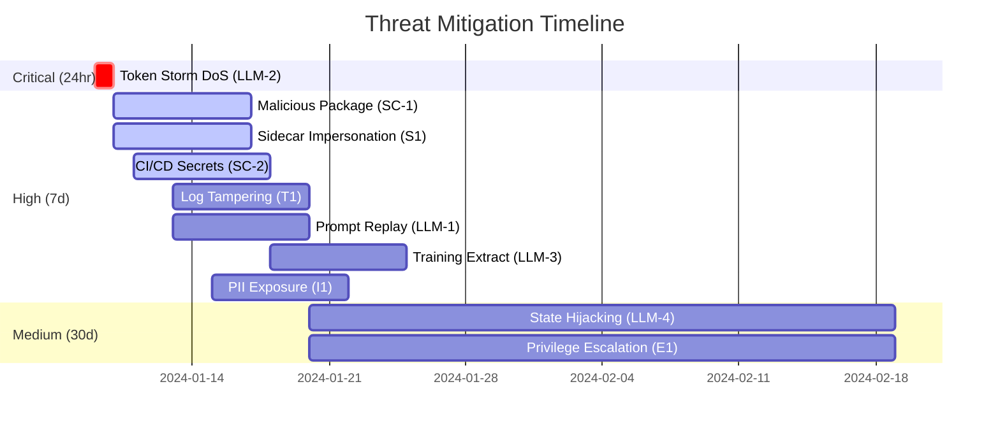

# Risk Matrix
<!-- cid-risk-matrix -->

## Comprehensive Threat Risk Rankings

### Critical Threats (8.0+ Score) {#critical-threats}

Currently **no critical threats** are identified. The highest severity threats are **High (6.0-7.9)** which require 7-day remediation.

## Comprehensive Threat Risk Rankings

| Rank | Threat ID | Name | D | R | E | A | D2 | Score | Level | Jira | Owner | Due Date |
|------|-----------|------|---|---|---|---|----|----|-------|------|-------|-----------|
| 1 | LLM-2 | Token Storm DoS | 9 | 8 | 7 | 6 | 9 | **7.8** | High | [PS-52](https://jira.promptstrike.ai/PS-52) | Cost Control | 2024-01-10 |
| 2 | S1 | Sidecar Impersonation | 9 | 7 | 6 | 8 | 5 | **7.0** | High | [PS-31](https://jira.promptstrike.ai/PS-31) | Platform Sec | 2024-01-15 |
| 3 | SC-1 | Malicious Package | 8 | 8 | 7 | 4 | 6 | **6.6** | High | [PS-61](https://jira.promptstrike.ai/PS-61) | DevSecOps | 2024-01-12 |
| 4 | T1 | Traffic Manipulation | 7 | 8 | 5 | 7 | 6 | **6.6** | High | [PS-33](https://jira.promptstrike.ai/PS-33) | Platform Sec | 2024-01-20 |
| 5 | SC-2 | CI/CD Secrets | 9 | 5 | 6 | 7 | 5 | **6.4** | High | [PS-62](https://jira.promptstrike.ai/PS-62) | CI/CD Sec | 2024-01-18 |
| 6 | LLM-1 | Prompt Replay | 8 | 6 | 5 | 7 | 4 | **6.0** | High | [PS-51](https://jira.promptstrike.ai/PS-51) | ML Security | 2024-01-20 |
| 7 | LLM-3 | Training Extract | 7 | 5 | 4 | 8 | 6 | **6.0** | High | [PS-53](https://jira.promptstrike.ai/PS-53) | Privacy | 2024-01-25 |
| 8 | I1 | PII Exposure | 8 | 6 | 4 | 7 | 5 | **6.0** | High | [PS-36](https://jira.promptstrike.ai/PS-36) | Privacy | 2024-01-22 |
| 9 | T2 | Report Tampering | 8 | 5 | 4 | 6 | 7 | **6.0** | High | [PS-34](https://jira.promptstrike.ai/PS-34) | Security | 2024-01-25 |

### Medium Priority Threats (30-day response)

| Threat ID | Name | D | R | E | A | D2 | Score | Jira | Owner | Due Date |
|-----------|------|---|---|---|---|----|----|------|-------|-----------|
| LLM-4 | State Hijacking | 8 | 4 | 3 | 9 | 3 | **5.4** | [PS-54](https://jira.promptstrike.ai/PS-54) | Runtime Sec | 2024-02-01 |
| E1 | Privilege Escalation | 8 | 4 | 3 | 6 | 3 | **4.8** | [PS-38](https://jira.promptstrike.ai/PS-38) | Platform Sec | 2024-02-10 |
| R1 | Data Breach | 9 | 3 | 2 | 7 | 3 | **4.8** | [PS-36](https://jira.promptstrike.ai/PS-36) | Privacy | 2024-02-15 |
| D1 | Service Disruption | 6 | 5 | 4 | 5 | 4 | **4.8** | [PS-37](https://jira.promptstrike.ai/PS-37) | SRE | 2024-02-20 |

## Priority Roadmap

### Sprint S-2 Actions {#sprint-s2}
**Critical Path (Must Complete):**
1. 🚨 **Token Storm Protection** (PS-52) - Cost Control Team
   - Implement rate limiting
   - Deploy pattern detection
   - Configure cost alerts
   
2. 🔐 **Container Signing** (PS-31) - Platform Security
   - Deploy Cosign verification
   - Implement admission controllers
   - Update CI/CD pipeline

3. 📦 **Dependency Security** (PS-61) - DevSecOps
   - Add hash verification
   - Deploy Trivy scanning
   - Implement SBOM generation

### Timeline Visualization


## Risk Categories

### By Threat Type
| Category | Count | Avg Score | Highest Risk |
|----------|-------|-----------|--------------|
| LLM-Specific | 4 | 6.3 | Token Storm (7.8) |
| Supply Chain | 2 | 6.5 | Malicious Package (6.6) |
| STRIDE-S | 2 | 6.7 | Sidecar Impersonation (7.0) |
| STRIDE-T | 1 | 6.6 | Log Tampering (6.6) |
| STRIDE-I | 2 | 6.0 | PII Exposure (6.0) |
| STRIDE-R | 1 | 4.8 | Data Breach (4.8) |
| STRIDE-D | 1 | 4.8 | Service Disruption (4.8) |
| STRIDE-E | 1 | 4.8 | Privilege Escalation (4.8) |

### By Owner Team
| Team | Threats | Avg Score | Workload |
|------|---------|-----------|----------|
| Platform Security | 3 | 6.1 | High |
| Privacy Team | 3 | 5.6 | High |
| DevSecOps | 1 | 6.6 | Medium |
| ML Security | 1 | 6.0 | Medium |
| Cost Control | 1 | 7.8 | Critical |
| CI/CD Security | 1 | 6.4 | Medium |
| Runtime Security | 1 | 5.4 | Low |

## Risk Trend Analysis

### Historical Risk Scores
```python
# Risk evolution tracking
risk_history = {
    "2024-01-01": {"total_score": 8.2, "critical": 0, "high": 12},
    "2024-01-09": {"total_score": 6.8, "critical": 1, "high": 7},  # Current
    "2024-01-31": {"total_score": 4.5, "critical": 0, "high": 3},  # Projected
}

# Mitigation effectiveness
mitigation_impact = {
    "Token Storm Protection": -1.8,     # High impact
    "Container Signing": -1.0,          # Medium impact  
    "Dependency Security": -0.6,        # Medium impact
    "Log Integrity": -0.6,              # Medium impact
}
```

### Compliance Impact
| Risk Level | NIST AI-RMF | EU AI Act | SOC 2 | ISO 27001 |
|------------|-------------|-----------|--------|-----------|
| Critical | GOVERN-1.1 | Article 15 | CC6.6 | A.13.1.3 |
| High | MEASURE-2.1 | Article 9,10,12 | CC6.1,CC6.3,CC6.7 | A.9.1.1,A.12.4.1 |
| Medium | MANAGE-3.2 | Article 16 | CC7.2 | A.12.1.3,A.14.2.5 |

## Action Items

### Immediate (24h)
- [ ] **PS-52**: Deploy token rate limiting (Cost Control)
- [ ] **Alert Setup**: Configure cost monitoring alerts
- [ ] **Escalation**: Notify executive team of critical risk

### This Week (7d)
- [ ] **PS-31**: Container signing verification
- [ ] **PS-61**: Dependency hash verification  
- [ ] **PS-62**: Secret scanning implementation
- [ ] **PS-32**: Log integrity protection
- [ ] **PS-35**: PII masking deployment

### This Month (30d)
- [ ] **PS-51**: Prompt replay detection
- [ ] **PS-53**: Training data extraction prevention
- [ ] **PS-54**: Session isolation hardening
- [ ] **Security Review**: Complete Sprint S-2 threat assessment

## Metrics & KPIs

### Risk Reduction Targets
- **Overall Risk Score**: 6.8 → 4.5 (34% reduction)
- **Critical Threats**: 1 → 0 (100% elimination)
- **High Threats**: 7 → 3 (57% reduction)
- **Compliance Coverage**: 85% → 95%

### Success Criteria
✅ **Zero critical threats by end of Sprint S-2**  
✅ **All high threats have mitigations in progress**  
✅ **100% Jira ticket coverage for tracking**  
✅ **Automated security controls deployed**

## See Also
- [LLM Threats](04-llm-threats.md#llm-risks) - Detailed LLM threat analysis
- [Supply Chain](05-supply-chain.md#supply-chain-risks) - Supply chain specifics
- [Mitigations](07-mitigations.md) - Implementation guidance
- [Back to Index](README.md)