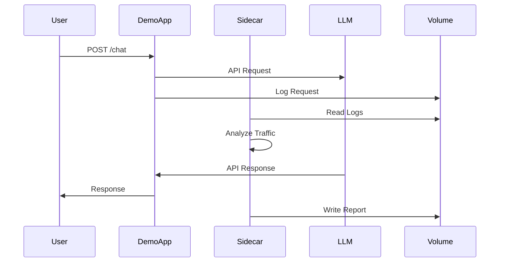

# Architecture Overview
<!-- cid-architecture-overview -->

## System Design

### Deployment Model
```
┌─────────────────────────────────────────┐
│          Kubernetes Pod                 │
│  ┌─────────────┐  ┌───────────────┐    │
│  │   Demo App  │  │   Guardrail   │    │
│  │   :8000     │◄─┤   Sidecar     │    │
│  │             │  │   :8001       │    │
│  └──────┬──────┘  └───────┬───────┘    │
│         │                  │            │
│         ▼                  ▼            │
│    ┌────────────────────────────┐      │
│    │     Shared Volume          │      │
│    │     /var/reports           │      │
│    └────────────────────────────┘      │
└─────────────────────────────────────────┘
                    │
                    ▼
            External LLM APIs
```

## Data Flow Analysis

### 1. Request Flow


### 2. Security Interception Points

| Point | Component | Data Type | Risk Level |
|-------|-----------|-----------|------------|
| A | User→Demo | HTTP Request | Medium |
| B | Demo→LLM | API Call | High |
| C | Demo→Volume | Logs | High |
| D | Sidecar→Volume | Reports | Medium |
| E | Volume→External | Exports | Critical |

### 3. Trust Boundaries

```yaml
trust_boundaries:
  - name: "Pod Boundary"
    crosses:
      - User traffic → Demo App
      - Demo App → External LLM
    controls:
      - Network policies
      - Service mesh
      
  - name: "Container Boundary"  
    crosses:
      - Demo App → Sidecar
      - Both → Shared Volume
    controls:
      - Pod security policies
      - RBAC
      
  - name: "Data Boundary"
    crosses:
      - Logs → Analysis
      - Reports → Export
    controls:
      - Encryption at rest
      - Access controls
```

## Component Details

### Demo Application
- **Purpose**: Simulates LLM-powered application
- **Technology**: FastAPI (Python 3.11)
- **Endpoints**:
  - `POST /chat` - Main LLM interaction
  - `GET /health` - Liveness probe
  - `GET /metrics` - Prometheus metrics
- **Dependencies**: OpenAI SDK, httpx

### Guardrail Sidecar
- **Purpose**: Security monitoring and analysis
- **Technology**: FastAPI (Python 3.11)
- **Endpoints**:
  - `POST /security/analyze` - Traffic analysis
  - `GET /security/report` - Report generation
  - `GET /health` - Liveness probe
- **Capabilities**:
  - Prompt injection detection
  - PII masking
  - Cost tracking
  - Compliance logging

### Shared Volume
- **Type**: EmptyDir (production: PersistentVolume)
- **Mount**: `/var/reports`
- **Contents**:
  - Request/response logs
  - Security analysis reports
  - Compliance evidence
- **Risks**: Cross-container access

## Network Architecture

### Service Topology
```yaml
Services:
  - name: demo-app-service
    type: ClusterIP
    ports: [8000]
    
  - name: sidecar-service  
    type: ClusterIP
    ports: [8001]
    
  - name: nodeport-service
    type: NodePort
    ports: 
      - 30000 → 8000
      - 30001 → 8001
```

### Network Policies
```yaml
apiVersion: networking.k8s.io/v1
kind: NetworkPolicy
metadata:
  name: guardrail-network-policy
spec:
  podSelector:
    matchLabels:
      app: guardrail
  ingress:
    - from:
        - namespaceSelector:
            matchLabels:
              name: redforge
      ports:
        - port: 8000
        - port: 8001
  egress:
    - to: []  # External APIs
      ports:
        - port: 443  # HTTPS only
```

## Security Zones

### Zone Classification
1. **Public Zone**: External user access
2. **DMZ**: Demo app interface
3. **Trusted Zone**: Sidecar analysis
4. **Restricted Zone**: Shared volume

### Data Classification
| Data Type | Classification | Location | Encryption |
|-----------|---------------|----------|------------|
| User Prompts | Confidential | Volume | AES-256 |
| LLM Responses | Confidential | Volume | AES-256 |
| Analysis Reports | Internal | Volume | AES-256 |
| Metrics | Public | Memory | None |

## See Also
- [STRIDE Analysis](03-stride-analysis.md) - Threat analysis
- [Risk Matrix](06-risk-matrix.md) - Prioritized risks
- [Back to Index](README.md)